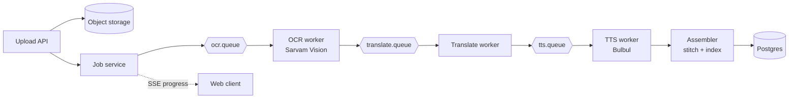

# Chitthi

[](https://github.com/prashant-singh-2001/chitthi-path-1/actions/workflows/ci.yml)
[](LICENSE)
[](https://openjdk.org/projects/jdk/21/)
[](https://spring.io/projects/spring-boot)

Turns scanned handwritten letters in Indian scripts into a searchable, translated,
listenable archive — Sarvam Vision (OCR) → Sarvam Translate → Bulbul (TTS),
behind an async, idempotent, resumable pipeline.

Full spec: [`Chitthi — Requirements Document.md`](Chitthi%20—%20Requirements%20Document.md).

## Why this project

The interesting part isn't the AI calls — it's the backend problems around
them: an async job pipeline that's resumable per page, idempotent retries
against rate-limited paid APIs, cost tracking, and full-text search across
scripts Postgres doesn't natively stem.

## Architecture



Each worker checks an idempotency key in Postgres before calling Sarvam,
persists the output, and publishes to the next queue via a transactional
outbox — so a retried or duplicated message never triggers a second paid
API call. See the requirements doc's [Architecture and pipeline
design](Chitthi%20—%20Requirements%20Document.md#architecture-and-pipeline-design)
section for the full page state machine.

## Status

- **Day 1–2:** project scaffold, Docker Compose infra, Flyway schema for
  the core pipeline tables, and a `SarvamClient` with a WireMock
  contract test pinning the Digitise job contract.
- **Day 3–4:** `POST /api/documents` and `GET /api/documents/{id}` —
  upload validation, PDF-to-page-image splitting (PDFBox), MinIO-backed
  storage, OCR batching into chunks of 10 pages, a RabbitMQ-backed OCR
  worker, and a scheduled status poller. A 12-page PDF upload now goes
  all the way to 12 pages of transcribed text: it produces two
  `ocr_batch` rows (a 10-page and a 2-page chunk), each submitted to
  Sarvam Document AI Digitise, polled with backoff, and applied back
  onto the `Page` rows as `OCR_DONE` with `original_text` and a
  `text_hash`.
  - The Digitise result ZIP's per-page text field name isn't pinned by
    Sarvam's public docs, so it's read from a configured candidate
    list (`chitthi.ocr.result.text-fields`) with a longest-string
    fallback; `SarvamDigitiseSmokeTest` makes one real, tagged,
    opt-in call to confirm and pin the real field name.
  - Idempotency here is a per-batch atomic claim (an `UPDATE ...
    WHERE status = 'PENDING'`), not yet the `stage_task` idempotency
    key + transactional outbox the requirements doc describes — that,
    along with the Resilience4j rate limiter and dead-letter retry
    queue, is scheduled for Day 8–9.
- **Day 5–6:** translate and TTS stages, sentence chunking, and pure-Java
  WAV stitching. Each page that finishes OCR is translated to English
  (Sarvam Translate, source-language passthrough for English documents),
  then synthesized into audio (Bulbul TTS) — an `en` track always, plus
  an `orig` track when Bulbul supports the document's source language.
  Once every page of a document is terminal, `DocumentAssembler` stitches
  each track's per-page WAVs into one document-level track with
  `javax.sound.sampled` (no FFmpeg) and marks the document `COMPLETE` or
  `PARTIAL`. `GET /api/documents/{id}/audio?lang=orig|en` returns a
  presigned MinIO URL, falling back from `orig` to `en` when the source
  language has no Bulbul coverage. A 12-page Hindi PDF now plays end to
  end in both languages.
  - Also fixed a pre-existing bug from Day 3–4: the OCR listener
    container factory built `SimpleRabbitListenerContainerFactory`
    directly, which silently ignored `spring.rabbitmq.listener.simple.retry`
    — a failing message skipped straight past its 3 configured retries
    to the dead-letter queue. Every stage's factory now goes through
    `SimpleRabbitListenerContainerFactoryConfigurer`.
  - Same idempotency gap as Day 3–4: a redelivered translate/TTS message
    can trigger a duplicate paid call even though the status/hash-guarded
    write keeps the stored result correct. `stage_task` keys and rate
    limiting are still Day 8–9.
- **Day 7:** live progress and a minimal React frontend. Every stage's
  state service (OCR, translate, TTS, assemble, and pipeline failure
  recovery) now publishes a `DocumentProgressEvent` after it commits;
  `GET /api/documents/{id}/events` streams it over Server-Sent Events as
  a full `(document status, every page's status)` snapshot per message,
  so a client that connects late or reconnects mid-pipeline is never
  wrong, and the stream completes itself once the document reaches
  `COMPLETE`/`PARTIAL`. A heartbeat every 15s keeps idle connections
  alive through proxies. The `/frontend` Vite + React + TypeScript app
  uploads a document, opens that stream to show pages advancing live,
  and plays both audio tracks once the document finishes.
  - `SseEmitterRegistry` tracks open connections per document in memory,
    fine for a single instance; several instances would need a shared
    fanout (e.g. one RabbitMQ topic per document) — noted as a
    `TODO(scale)`.
- **Day 8–9:** idempotency keys, a transactional outbox, delayed retry and
  dead-letter queues, and Resilience4j limiters — the gaps every earlier
  day's status notes flagged.
  - `SarvamClient` routes every paid call through one Resilience4j chain
    per endpoint (`vision-submit`, `translate`, `tts`): a 429 becomes
    `SarvamRateLimitedException` and is retried using Sarvam's own
    `Retry-After`, a circuit breaker opens on repeated 5xx/IO failures
    (never on a 429 or another 4xx), and a rate limiter shapes calls as a
    continuously-replenishing token bucket rather than a once-a-minute
    reset.
  - The four `@TransactionalEventListener(AFTER_COMMIT)` dispatchers are
    gone. Every stage now enqueues its next message through a
    transactional outbox (`OutboxService.enqueue`, in the same
    transaction as the state change), relayed with publisher confirms by
    `OutboxRelay` every 200ms — closing the crash-between-commit-and-publish
    gap those dispatchers always had.
  - Every translate and TTS chunk's Sarvam call is guarded by a
    `stage_task` row (`StageTaskService`): a redelivered message reuses a
    DONE row's result with no second call, and a row still RUNNING under a
    live lease is left alone rather than called again. (Translate keys are
    page-scoped; Day 10 makes TTS keys owner-scoped instead — see below.)
  - A failing message goes through up to two delayed retry tiers
    (`chitthi.retry.delays`, default 5s/30s) before it's dead-lettered —
    one retry queue per (destination queue, delay), each declared with an
    explicit `x-dead-letter-routing-key` back to its destination, so no
    tier depends on RabbitMQ's default routing-key preservation. A pause
    (rate limiter, circuit breaker, or a busy `stage_task`) goes back to
    the first tier without spending an attempt. `POST
    /api/documents/{id}/retry` (FR7) re-queues a document's FAILED pages
    manually.
  - `ChaosPipelineIntegrationTest` proves the acceptance criterion — 0
    duplicate paid calls — by injecting a transient and a persistent 5xx
    rather than killing a real worker process, which would repeat the Day
    7 CI resource-pressure incident on the same shared runner. A real
    "kill -9 mid-call" scenario is a manual exercise: run two `mvn
    spring-boot:run` instances is not supported (only one worker set is
    wired per process), so instead upload a document, kill the app
    mid-TTS, and restart it — the `stage_task` rows show one DONE row per
    chunk and the document still reaches `COMPLETE`.
- **Day 10:** an edit flow with partial regeneration, and a TTS cache by
  text hash — editing page 3 re-runs only page 3.
  - `PUT /api/documents/{id}/pages/{pageNo}/text` (FR8) resets a page to
    `OCR_DONE` with the new text and re-queues translation for that page
    alone; everything downstream re-runs through the ordinary pipeline.
    Saving the exact same text is a no-op. A `FAILED` page with no
    recovered OCR text can still be edited — typing the text in by hand is
    that page's recovery path, filling the gap Day 8–9's manual retry
    can't close for an OCR-stage failure. A still-`PENDING` page is
    rejected with 409.
  - `IdempotencyKeys.forTtsAudio` (FR13) re-scopes the TTS `stage_task` key
    from per-page to per-owner: two pages — even across two documents —
    that ask for the same text in the same voice for the same owner share
    one cached result, and the cached audio itself moves to a
    content-addressed key (`tts-cache/{ownerId}/{contentHash}.wav`).
    That also fixed a latent bug: the old *positional* chunk key
    (`.../chunks/{pageId}/{track}/{idx}.wav`) meant an edit's new audio
    would silently overwrite the file an older, still-cached call pointed
    at — reverting an edit would then get the new audio back from a false
    cache hit.
  - The `/frontend` app gets an "Edit text" button per page once a
    document is terminal; saving reopens the SSE stream (which had closed
    itself) so the page watches its own regeneration live, exactly as the
    first pass looked.
  - `EditFlowIntegrationTest` is the milestone: editing page 3 makes
    exactly one new translate call and two new TTS calls, all for page
    3's text, while pages 1 and 2 go untouched; reverting page 3 to its
    original text costs zero new calls of either kind, since Day 8–9's
    `stage_task` rows from the first pass already answer both.

See the [delivery plan](Chitthi%20—%20Requirements%20Document.md#two-week-delivery-plan)
for what's next.

## Prerequisites

- JDK 21+
- Docker Desktop
- Maven
- Node 22+ (for the `/frontend` app)

## Run infra locally

```
docker compose up -d
```

Starts Postgres (`55432` on the host — `5432` is remapped because a
native Postgres install already occupies it on this machine), RabbitMQ
(`5672`, management UI on `15672`), and LocalStack's S3 service (`4566`)
standing in for object storage — MinIO's own images are no longer
freely pullable from either Docker Hub or quay.io as of September 2026,
so `ObjectStorageService`'s MinIO Java client points at LocalStack
instead; it speaks the generic S3 API either way.

## Build and test

```
mvn clean verify
```

Flyway migrates the schema on application startup. Tests use WireMock
for Sarvam contract tests and Testcontainers for Postgres/RabbitMQ/LocalStack
— no real Sarvam API calls happen in the standard test suite. A tagged
smoke test that does make one real, paid Digitise call is excluded by
default; run it deliberately with `mvn test -Dgroups=smoke` once
`SARVAM_API_KEY` is set.

## Run the frontend

```
cd frontend
npm install
npm run dev
```

The dev server proxies `/api` to `http://localhost:8080`, so run the
Spring Boot app (`mvn spring-boot:run`, with infra up and
`SARVAM_API_KEY` set) alongside it. See [`frontend/README.md`](frontend/README.md)
for its own build and test commands.

## Configuration

Set `SARVAM_API_KEY` before running against the real API. See
`src/main/resources/application.yml` for pipeline tuning (chunk sizes,
concurrency, rate limits) mirrored from Sarvam's documented limits.

## Contributing

See [CONTRIBUTING.md](CONTRIBUTING.md) for local setup and how to
propose changes.

## License

[MIT](LICENSE)
