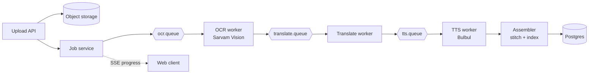

# Chitthi

[](https://github.com/prashant-singh-2001/chitthi-path-1/actions/workflows/ci.yml)
[](LICENSE)
[](https://openjdk.org/projects/jdk/21/)
[](https://spring.io/projects/spring-boot)

Turns scanned handwritten letters in Indian scripts into a searchable, translated,
listenable archive — Sarvam Vision (OCR) → Sarvam Translate → Bulbul (TTS),
behind an async, idempotent, resumable pipeline.

Full spec: [`Chitthi — Requirements Document.md`](Chitthi%20—%20Requirements%20Document.md).

## Why this project

The interesting part isn't the AI calls — it's the backend problems around
them: an async job pipeline that's resumable per page, idempotent retries
against rate-limited paid APIs, cost tracking, and full-text search across
scripts Postgres doesn't natively stem.

## Architecture



Each worker checks an idempotency key in Postgres before calling Sarvam,
persists the output, and publishes to the next queue via a transactional
outbox — so a retried or duplicated message never triggers a second paid
API call. See the requirements doc's [Architecture and pipeline
design](Chitthi%20—%20Requirements%20Document.md#architecture-and-pipeline-design)
section for the full page state machine.

## Status

Day 1–2 skeleton complete: project scaffold, Docker Compose infra, Flyway
schema for the core pipeline tables, and a `SarvamClient` with a WireMock
contract test pinning the Digitise job contract. Pipeline workers
(upload, OCR batching, translate/TTS, SSE progress) land in later days
per the [delivery plan](Chitthi%20—%20Requirements%20Document.md#two-week-delivery-plan).

## Prerequisites

- JDK 21+
- Docker Desktop
- Maven

## Run infra locally

```
docker compose up -d
```

Starts Postgres (`55432` on the host — `5432` is remapped because a
native Postgres install already occupies it on this machine), RabbitMQ
(`5672`, management UI on `15672`), and MinIO (`9000`, console on `9001`).

## Build and test

```
mvn clean verify
```

Flyway migrates the schema on application startup. Tests use WireMock
for Sarvam contract tests and Testcontainers for Postgres/RabbitMQ —
no real Sarvam API calls happen in the standard test suite.

## Configuration

Set `SARVAM_API_KEY` before running against the real API. See
`src/main/resources/application.yml` for pipeline tuning (chunk sizes,
concurrency, rate limits) mirrored from Sarvam's documented limits.

## Contributing

See [CONTRIBUTING.md](CONTRIBUTING.md) for local setup and how to
propose changes.

## License

[MIT](LICENSE)
